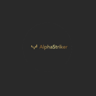

---

# AlphaStriker

Bot de trading avancé pour la blockchain Solana, combinant FastAPI (backend), React/Tailwind (frontend), et IA Gemini 2.5 Flash. Il surveille la blockchain en temps réel, analyse les nouveaux tokens SPL, exécute des trades sécurisés et apprend en continu grâce à une base de réputation locale (SQLite).

---

## 🛠️ Prérequis logiciels

### Linux (Ubuntu 22.04/24.04 LTS, Oracle Cloud, VPS, ARM/x86_64)

Installer tous les prérequis :

```bash
sudo apt update && sudo apt upgrade -y
sudo apt install -y git curl python3 python3-pip ufw
# Installer Docker
curl -fsSL https://get.docker.com | sh
sudo usermod -aG docker $USER
newgrp docker
docker --version
# Installer Node.js (v18 LTS)
curl -fsSL https://deb.nodesource.com/setup_18.x | sudo -E bash -
sudo apt install -y nodejs
node -v
# Installer Yarn
yarn --version || npm install -g yarn
yarn --version
# (Optionnel) Activer le pare-feu UFW
sudo ufw allow 22; sudo ufw allow 8000; sudo ufw allow 3000; sudo ufw enable; sudo ufw status
```

### Windows 10/11

Installer :

- [Docker Desktop](https://www.docker.com/products/docker-desktop/)
- [Node.js](https://nodejs.org/en/download/) (v18+)
- [Python 3.10+](https://www.python.org/downloads/)
- [Git](https://git-scm.com/download/win)
- Yarn : ouvrir PowerShell puis `npm install -g yarn`

---

## 🚦 Installation rapide (Linux/Windows, ARM/x86_64, Oracle Cloud & VPS)

1. **Cloner le dépôt**
   ```bash
   git clone https://github.com/votre-utilisateur/solana-ai-trading-bot.git
   cd solana-ai-trading-bot
   ```
2. **Installation automatique**
   - **Linux/Oracle/ARM/x86_64** :
     ```bash
     chmod +x install.sh
     ./install.sh
     ```
   - **Windows (PowerShell)** :
     ```powershell
     ./install_bot.sh
     ```
   *Le script détecte l’architecture, installe les dépendances, build l’image Docker multi-arch, configure le firewall, et lance tout automatiquement.*
3. **Configurer vos secrets**
   - Éditez `.env` (créé par le script) et ajoutez vos clés OpenRouter, TrustWallet, Gemini, etc.
   - **Ne partagez jamais votre fichier .env !**
4. **Lancer AlphaStriker**
   ```bash
   ./run.sh
   ```
   - Dashboard : http://<IP_DE_VOTRE_SERVEUR>:3000
   - Backend API : http://<IP_DE_VOTRE_SERVEUR>:8000
<div align="center">
  
  <h1>AlphaStriker – Solana AI Trading Bot</h1>
  <b>Ultra-robust, cross-architecture (ARM/x86_64) AI trading bot for Solana.<br>FastAPI backend, React/Tailwind frontend, Gemini AI, Docker multi-arch.</b>
</div>

---

# 🚀 Features

- **Real-time Solana blockchain monitoring** (new SPL tokens, liquidity, honeypot, blacklist, holders checks)
- **AI-powered trading** (Google Gemini 2.5 Flash integration)
- **Backtesting engine** (simulate strategies before live trading)
- **Security-first**: All trades pass liquidity, honeypot, blacklist, and holders checks
- **Local reputation DB** (SQLite) for tokens/wallets
- **Advanced dashboard** (React/Tailwind, live metrics, logs, Gemini chat)
- **Multi-arch Docker**: Runs on ARM (Oracle Cloud Ampere) & x86_64 (all major VPS)
- **Ultra-detailed logs**: simulation_trades.log, real_trades.log
- **Self-repairing AI agent**: Gemini can patch/restore code via the dashboard

---

# 🏗️ Project Structure

```
solana-ai-trading-bot/
├── backend/           # FastAPI backend (trading, AI, blockchain, DB, security)
│   ├── main.py
│   ├── requirements.txt
│   ├── ...
├── frontend/          # React + Tailwind dashboard
│   ├── src/components/
│   ├── public/
│   ├── ...
├── Dockerfile         # Multi-arch (ARM/x86_64) build
├── install.sh         # Linux install script (auto-detects arch)
├── install_bot.sh     # Windows install script
├── run.sh             # Run script (Linux/Windows)
├── .env.example       # Example env file (never commit secrets)
└── README.md
```

---

# 🖥️ Quick Start (Linux/Windows, ARM/x86_64, Oracle Cloud & Standard VPS)

## 1. Clone the repo

```bash
git clone https://github.com/votre-utilisateur/AlphaStriker.git
cd AlphaStriker
```

## 2. Automated install (Linux/ARM/x86_64/Oracle/Windows)

### Linux/Oracle Cloud (Ampere ARM or x86_64)

```bash
# For ARM (Ampere A1) or x86_64 (E2/VM.Standard) on Oracle Cloud or any Ubuntu VPS:
chmod +x install.sh
./install.sh
```

### Windows (PowerShell)

```powershell
./install_bot.sh
```

*The script auto-detects your architecture, installs Docker, Node, Python, builds the multi-arch image, sets up firewall, and launches everything.*

## 3. Configure your secrets

- Edit `.env` (created by the script) and add your OpenRouter, TrustWallet, Gemini API keys, etc.
- **Never share your .env file!**

## 4. Start AlphaStriker

```bash
./run.sh
```

- Dashboard: http://<YOUR_SERVER_IP>:3000
- Backend API: http://<YOUR_SERVER_IP>:8000

---

# 🏆 Ultra-Detailed Installation Guides

## Guide 1: Oracle Cloud (Ampere ARM, Ubuntu 22.04/24.04 LTS)

1. **Create an Ampere A1 (ARM) instance** (Oracle Cloud, Ubuntu 22.04/24.04 LTS)
2. **SSH in and update system:**
   ```bash
   sudo apt update && sudo apt upgrade -y
   ```
3. **Install Docker (multi-arch):**
   ```bash
   curl -fsSL https://get.docker.com | sh
   sudo usermod -aG docker $USER
   newgrp docker
   docker --version
   ```
4. **Clone the repo:**
   ```bash
   git clone https://github.com/votre-utilisateur/solana-ai-trading-bot.git
   cd solana-ai-trading-bot
   ```
5. **Run the install script:**
   ```bash
   chmod +x install.sh
   ./install.sh
   ```
6. **Edit `.env` and add your secrets:**
   ```bash
   nano .env
   # Add OpenRouter, TrustWallet, Gemini keys, etc.
   ```
7. **Start the bot:**
   ```bash
   ./run.sh
   ```
8. **Access the dashboard:**
   - http://<YOUR_SERVER_IP>:3000 (frontend)
   - http://<YOUR_SERVER_IP>:8000/docs (API docs)

**Tips:**
- For best price/performance, always use Ampere A1 (ARM) on Oracle Cloud.
- Change admin password on first login (via UI or .env).
- Regularly backup `logs/` and `data/` (SQLite DB).
- To update: `git pull && ./install.sh && ./run.sh`
- View logs: `docker logs -f alphastriker-instance` or `tail -f logs/real_trades.log`

---

## Guide 2: Standard x86_64 VPS (Ubuntu 22.04/24.04 LTS, Hetzner, OVH, Oracle E2, etc.)

1. **Create a VPS (x86_64, Ubuntu 22.04/24.04 LTS)**
2. **SSH in and update system:**
   ```bash
   sudo apt update && sudo apt upgrade -y
   ```
3. **Install Docker:**
   ```bash
   curl -fsSL https://get.docker.com | sh
   sudo usermod -aG docker $USER
   newgrp docker
   docker --version
   ```
4. **Clone the repo:**
   ```bash
   git clone https://github.com/votre-utilisateur/solana-ai-trading-bot.git
   cd solana-ai-trading-bot
   ```
5. **Run the install script:**
   ```bash
   chmod +x install.sh
   ./install.sh
   ```
6. **Edit `.env` and add your secrets:**
   ```bash
   nano .env
   # Add OpenRouter, TrustWallet, Gemini keys, etc.
   ```
7. **Start the bot:**
   ```bash
   ./run.sh
   ```
8. **Access the dashboard:**
   - http://<YOUR_SERVER_IP>:3000 (frontend)
   - http://<YOUR_SERVER_IP>:8000/docs (API docs)

**Tips:**
- x86_64 is only needed for rare native library compatibility. Prefer ARM for cost/performance.
- Secure SSH access and change admin password immediately.
- All logs and data are in `logs/` and `data/`.

---

# 🛠️ Development

## Backend (FastAPI)

```bash
cd backend
pip install -r requirements.txt
uvicorn main:app --reload --host 0.0.0.0 --port 8000
# API docs: http://localhost:8000/docs
```

## Frontend (React)

```bash
cd frontend
yarn install
yarn start
# Frontend: http://localhost:3000
```

---

# 📊 Dashboard & Features

- **Dashboard**: Real-time metrics, trades, logs, AI chat, advanced monitoring
- **Settings**: All secrets/keys editable in UI (never exposed to frontend code)
- **Gemini Chat**: Ask Gemini to analyze, explain, or patch code (Python/React)
- **Backtesting**: Simulate strategies before live trading
- **Security**: All trades pass liquidity, honeypot, blacklist, holders checks
- **Logs**: simulation_trades.log, real_trades.log (auto-generated)
- **Self-repair**: Gemini agent can patch/restore backend code if broken

---

# 🔒 Security & AI

- All secrets in `.env` (never commit or share)
- Gemini AI can only patch non-secret files (user must validate all changes)
- All code changes via Gemini are logged and auditable
- Backend is always the source of truth for parameters

---

# 🤖 Gemini AI Integration

- Gemini (OpenRouter) can read/patch any non-secret file for self-repair
- All requests/responses are logged for audit
- User must validate all code changes before application
- Gemini agent: `backend/ai_analysis/gemini_agent.py` (never delete/corrupt)

---

# 📝 License

MIT